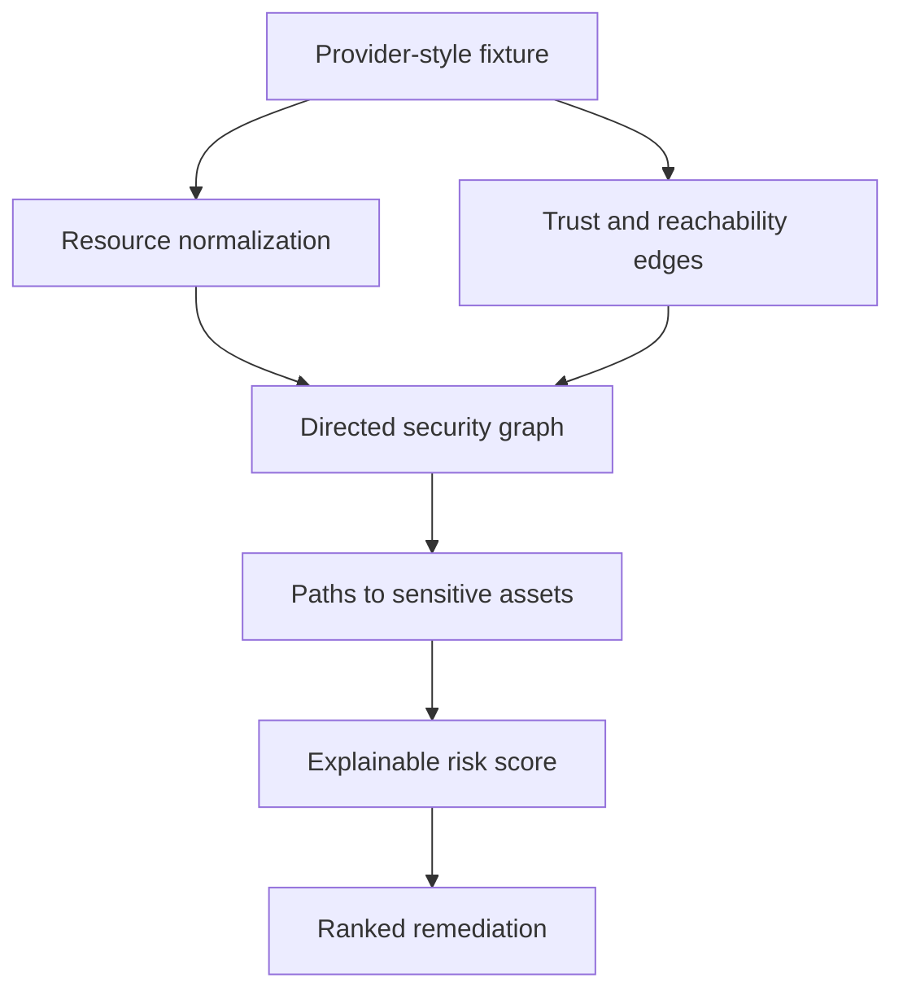

# Cloud Attack-Path and Misconfiguration Prioritizer

[](https://github.com/niketkrishnan/cloud-attack-path-prioritizer/actions/workflows/ci.yml)

A read-only graph analyzer for cloud-configuration fixtures. Instead of listing isolated misconfigurations, it asks the more useful security question: **can an exposed entry point reach a sensitive asset through trust or privilege transitions?**

## One finding, end to end

The committed example models **6 resources** and **5 relations**. Its highest-ranked path is:

```text
public-api -> app-role -> prod-db
score: 1.0
reasons: public start, sensitive destination, multiple trust transitions
remediation: remove public exposure, constrain the trust edge, and apply least privilege
```

This is the exact local output in [`artifacts/attack_paths.json`](artifacts/attack_paths.json). It is a read-only fixture result, not evidence of exploitability in a real account.

## Try it locally

```bash
python -m pip install -e '.[dev]'
python evaluate.py
pytest
```

Review [`src/attack_paths.py`](src/attack_paths.py) with [`tests/test_attack_paths.py`](tests/test_attack_paths.py). The tests make graph validation, path reachability, score factors, and remediation text inspectable.

## From configuration to prioritization



The abstraction is intentionally provider-neutral, but the implementation does not pretend that AWS IAM, Azure RBAC, and network controls have identical semantics. Provider-specific parsers and validation are required before operational use.

## What makes the result actionable

A path is ranked using visible factors such as public exposure, asset sensitivity, privilege transitions, and criticality. The output carries both the path and the remediation sentence, so a reviewer can trace the score back to graph facts rather than a hidden severity label.

## Scope and next validation

The analyzer never authenticates to cloud accounts or changes resources. The next credible step is not a larger marketing claim; it is a pair of provider-labelled fixtures with expected-path labels and tests for false paths, parser errors, and path coverage.

## Continue through the portfolio

- [Explainable AI SOC Detection](https://github.com/niketkrishnan/explainable-ai-soc) — hybrid rules and anomaly scoring.
- [LLM Firewall and RAG Security Lab](https://github.com/niketkrishnan/llm-firewall-rag-security-lab) — trust boundaries for AI applications.
- [SBOM Supply-Chain Intelligence](https://github.com/niketkrishnan/sbom-supply-chain-intelligence) — software dependency risk decisions.
- [Identity Compromise Detector](https://github.com/niketkrishnan/identity-compromise-detector) — explainable identity risk.
- [Portfolio site](https://github.com/niketkrishnan/HTML-Website) — project overview and contact details.

For security concerns, use a private GitHub Security Advisory or contact [@niketkrishnan](https://github.com/niketkrishnan). Use synthetic fixtures only in public issues.
